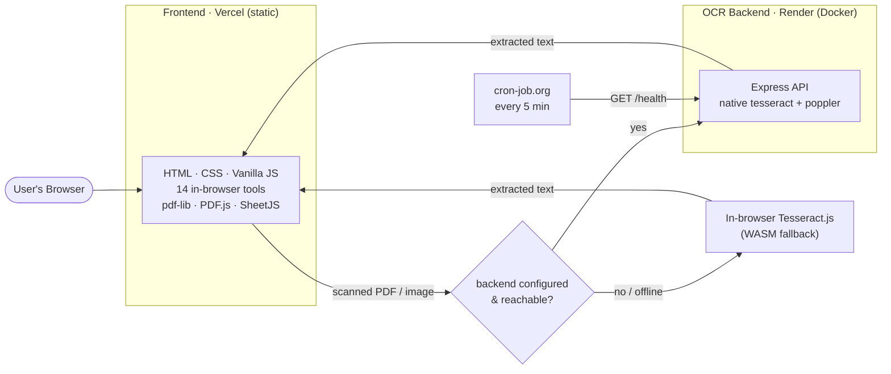

<div align="center">

# easePDF Toolkit 🧰

### A complete suite of free, privacy-first PDF tools that run entirely in your browser.

**No file uploads · No accounts · No cost.** Every tool processes your files locally on your device — with an optional native-OCR backend for heavy lifting.

[](https://easepdf-toolkit.vercel.app)

[](LICENSE)
[](https://vercel.com)
[](https://render.com)
[](https://github.com/definitelynotDD/EasePDF/actions/workflows/ci.yml)


</div>

---

## 📑 Table of Contents

- [Overview](#-overview)
- [Features](#-features)
- [Spotlight Features](#-spotlight-features)
- [Architecture](#-architecture)
- [Tech Stack](#-tech-stack)
- [Project Structure](#-project-structure)
- [Running Locally](#-running-locally)
- [Deployment](#-deployment)
- [Contributing](#-contributing)
- [License](#-license)

---

## 🔭 Overview

**easePDF Toolkit** is a zero-backend-by-default web app offering **14 PDF tools** — merge, split, compress, convert, watermark, extract tables to Excel, OCR, and more. The core design principle: **your files never leave your device.** All standard tools run 100% client-side using WebAssembly and JS libraries; nothing is uploaded to a server.

The one exception is **OCR**, which offers a **hybrid architecture**: it prefers a self-hosted native [Tesseract](https://github.com/tesseract-ocr/tesseract) backend for maximum accuracy, but **automatically falls back** to an in-browser WebAssembly engine if the server is unavailable — so the app degrades gracefully and never breaks.

> **Why it's interesting (engineering-wise):** client-side document processing, a graceful-degradation hybrid OCR pipeline, a hardened Content-Security-Policy, a containerized microservice, and a free-tier keep-alive strategy — all in a dependency-light, build-step-free codebase.

---

## ✨ Features

| Category | Tools |
|---|---|
| 📦 **Organize** | Merge PDF · Split PDF · Rotate PDF |
| ✏️ **Edit** | Add Page Numbers · Watermark PDF |
| 🔄 **Convert** | JPG→PDF · PNG→PDF · PDF→JPG · PDF→Word · Word→PDF · Excel→PDF |
| 📊 **Extract** | **PDF Tables → Excel** ⭐ · **OCR PDF** (scanned → text) ⭐ |
| ⚙️ **Optimize** | Compress PDF |

Every standard tool runs **100% in the browser** — files never leave your device.

---

## 🌟 Spotlight Features

### 📊 PDF Tables → Excel

Most PDF tools ignore tabular data. easePDF's extractor detects table structure from text-based PDFs — clustering text by Y-coordinate into rows and grouping by X-position into columns — and exports every detected table as its own sheet in a single `.xlsx`, with a tunable sensitivity slider and a live preview.

### 🔍 OCR PDF — Hybrid Engine

Turns **scanned PDFs and images into selectable text**, with a two-tier engine:

| Mode | Engine | Where it runs | Accuracy |
|---|---|---|---|
| **Native** (preferred) | Native Tesseract + poppler | Render backend | Highest |
| **Fallback** (automatic) | Tesseract.js (WASM) | The browser | ~90% |

If the backend is configured and reachable, OCR runs there and the UI shows a green **🖥️ Native** badge; otherwise it transparently falls back to the in-browser engine (blue **🌐** badge) so the feature **always works**. Results can be copied or exported as `.txt` / `.docx`.

> ⚠️ **Privacy note:** standard tools never upload anything. Only the *native OCR* mode sends the file to the backend for processing; the in-browser fallback keeps everything local.

---

## 🏗 Architecture

The project is two independently deployed halves that communicate only over a single HTTP endpoint:



**Design decisions:**

- **Client-side first** — all non-OCR tools use WASM/JS libs, so there's no server to run, scale, or pay for, and user files stay private.
- **Graceful degradation** — the OCR tool tries the native backend, catches any failure (cold start, CORS, offline), and falls back to WASM without the user hitting a dead end.
- **Hardened CSP** — a strict `Content-Security-Policy` whitelists exactly the script/connect/worker origins required (CDN libs, the OCR WASM `data:` core, and the backend), blocking everything else.
- **Free-tier keep-alive** — Render's free instance sleeps after 15 min idle; an external cron pings `/health` every 5 min to keep the native engine warm, with cold-start fallback handled client-side.

---

## 🛠 Tech Stack

**Frontend**
- [pdf-lib](https://pdf-lib.js.org/) — create & modify PDFs
- [PDF.js](https://mozilla.github.io/pdf.js/) — render pages for preview & conversion
- [SheetJS](https://sheetjs.com/) — Excel generation (table extractor)
- [Tesseract.js](https://tesseract.projectnaptha.com/) — in-browser OCR (WASM)
- [mammoth.js](https://github.com/mwilliamson/mammoth.js) · [html2pdf.js](https://github.com/eKoopmans/html2pdf.js) · [docx](https://github.com/dolanmiu/docx) · [JSZip](https://stuk.github.io/jszip/) · [DOMPurify](https://github.com/cure53/DOMPurify)

**Backend** (`server/`)
- Node.js + [Express](https://expressjs.com/) · [Multer](https://github.com/expressjs/multer)
- Native [Tesseract OCR](https://github.com/tesseract-ocr/tesseract) + [Poppler](https://poppler.freedesktop.org/) (`pdftoppm`)
- Docker

**Infrastructure**
- Vercel (frontend) · Render (backend, Docker) · cron-job.org (keep-alive) · GitHub Actions (CI)

---

## 📁 Project Structure

```
EasePDF/
├── index.html                  # Frontend entry — markup + CDN <script> tags
├── css/style.css               # All styling
├── js/app.js                   # All app logic: 14 tools, PDF preview, OCR (backend + WASM fallback)
├── vercel.json                 # Vercel config + hardened Content-Security-Policy
│
├── server/                     # Native Tesseract OCR backend (deploys to Render)
│   ├── index.js                #   Express API: POST /ocr, GET /health
│   ├── Dockerfile              #   Node + tesseract-ocr (12 langs) + poppler-utils
│   ├── render.* / package.json #   deps & deploy config
│   └── README.md               #   Backend API + deploy guide
│
├── render.yaml                 # Render Blueprint (Docker, free plan, health check)
├── .github/
│   ├── workflows/              #   ci.yml (validation) + keep-alive.yml (cron ping)
│   ├── ISSUE_TEMPLATE/         #   bug & feature templates
│   └── PULL_REQUEST_TEMPLATE.md
└── assets/screenshots/         # README images
```

---

## 🏃 Running Locally

No build step for the frontend:

```bash
git clone https://github.com/definitelynotDD/EasePDF.git
cd EasePDF

# Serve the static site
python -m http.server 3000      # → http://localhost:3000
# or: npx serve .
```

Optional — run the native OCR backend (requires `tesseract` + `poppler`):

```bash
cd server
npm install
npm start                       # → http://localhost:10000

# then set OCR_BACKEND_URL in js/app.js to http://localhost:10000
```

See [`server/README.md`](server/README.md) for the full backend guide.

---

## 🚀 Deployment

| Component | Platform | How |
|---|---|---|
| **Frontend** | Vercel | Connect the repo; auto-deploys `main`. Headers/CSP from `vercel.json`. |
| **OCR backend** | Render | New → Blueprint (reads `render.yaml`, builds `server/Dockerfile`). |
| **Keep-alive** | cron-job.org | HTTP monitor → `GET /…/health` every 5 min. |

After deploying the backend, set `OCR_BACKEND_URL` in `js/app.js` and add the origin to `connect-src` in `vercel.json`. Details in [`server/README.md`](server/README.md).

---

## 🤝 Contributing

Contributions are welcome! Adding a tool is intentionally simple — each is a single entry in the `toolImplementations` map in `js/app.js`. See [CONTRIBUTING.md](CONTRIBUTING.md) for the full guide, and our [Code of Conduct](CODE_OF_CONDUCT.md).

---

## 📄 License

Licensed under the **MIT License** — see [LICENSE](LICENSE).

---

<div align="center">

Built by **[Your Name]** · [LinkedIn](https://linkedin.com/in/your-handle) · [GitHub](https://github.com/definitelynotDD)

Made with ❤️ — all standard processing happens in your browser, no data ever leaves your device.

</div>
