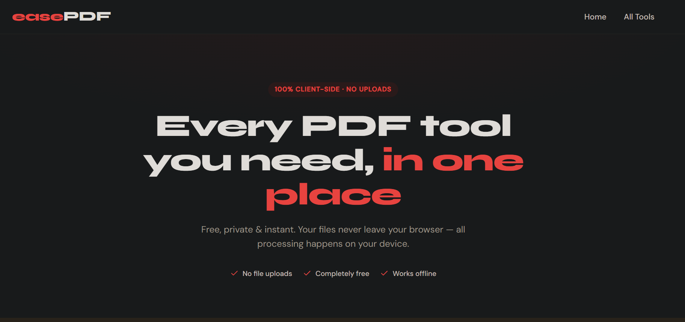
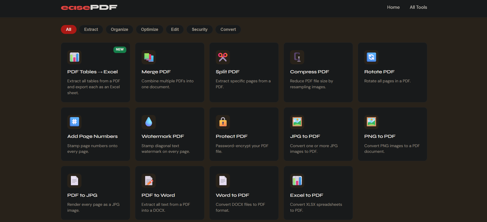
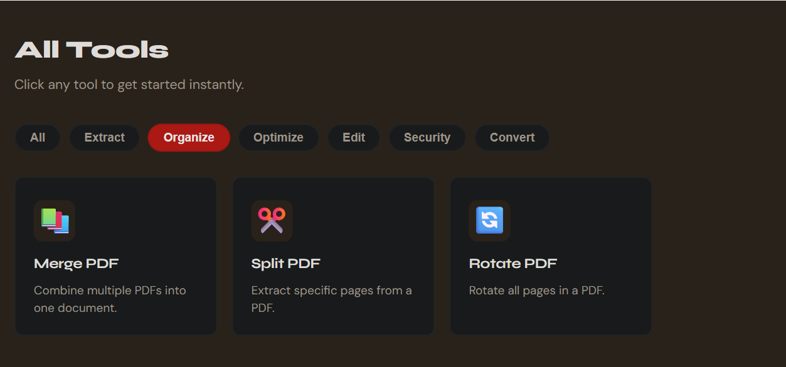
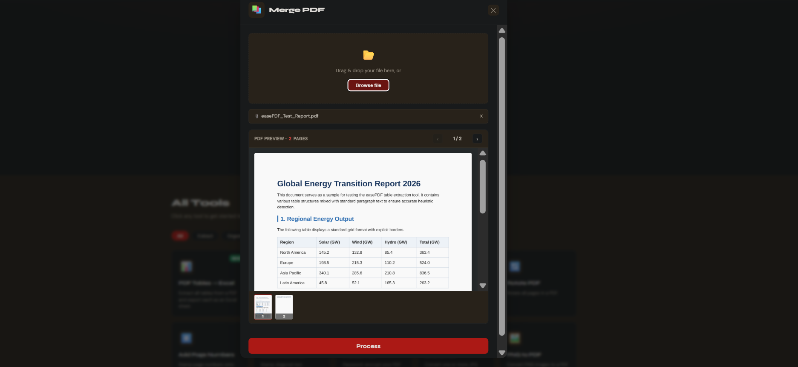
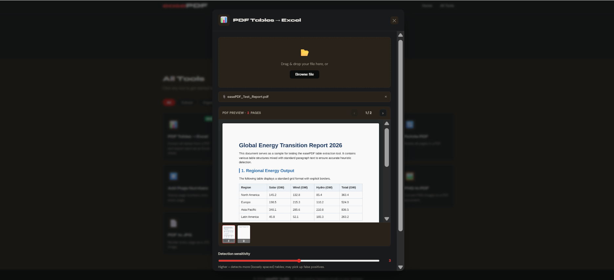
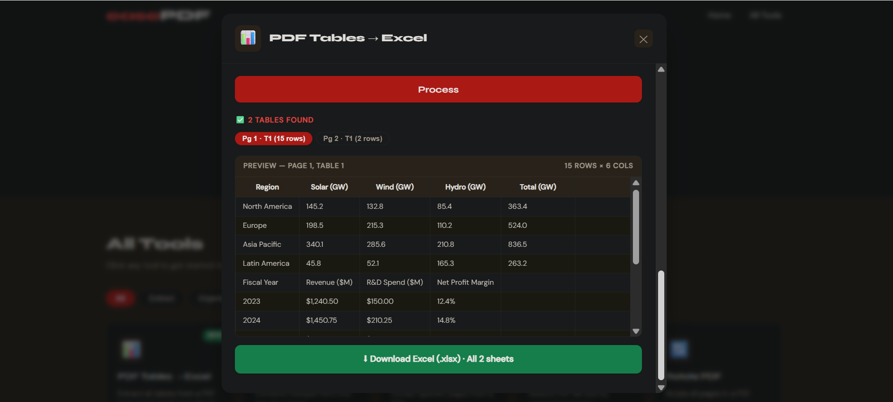
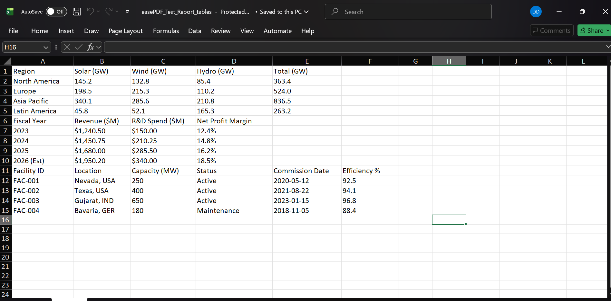

# easePDF Toolkit 🧰

> A complete suite of **free, private, client-side PDF tools** — all processing happens in your browser. No file uploads. No server. No cost.

<p align="center">
  
</p>

[](LICENSE)
[](https://vercel.com)


---

## ✨ Features

| Category | Tools |
|---|---|
| 📦 Organize | Merge PDF, Split PDF, Rotate PDF |
| ✏️ Edit | Add Page Numbers, Watermark PDF |
| 🔒 Security | Protect PDF (password encryption) |
| 🔄 Convert | JPG→PDF, PNG→PDF, PDF→JPG, PDF→Word, Word→PDF, Excel→PDF |
| 📊 Extract | **PDF Tables → Excel** ⭐ |
| ⚙️ Optimize | Compress PDF |

All tools run **100% in the browser** — your files never leave your device.

---

## 🖼️ Screenshots

### Home — All Tools at a Glance
<p align="center">
  
</p>

### Category Filter
<p align="center">
  
</p>

### Tool Modal — Drag & Drop + Live PDF Preview
<p align="center">
  
</p>

---

## 📊 Spotlight: PDF Tables → Excel

> **The standout feature of easePDF Toolkit.**

Most PDF tools ignore table data entirely. easePDF Toolkit's table extractor intelligently detects tabular structure from any text-based PDF and exports every table as its own sheet in a `.xlsx` file — all without a server.

<p align="center">
  
&nbsp;&nbsp;
  
</p>

### How it works

1. **Upload** any text-based PDF
2. The engine clusters text items by Y-coordinate to detect rows, then groups columns by X-position
3. A **sensitivity slider** (1–5) lets you tune detection — higher values catch loosely spaced tables
4. Every detected table is shown in a **live preview** with pill navigation (e.g. `Pg 1 · T1`, `Pg 2 · T1`)
5. All tables export into a single `.xlsx` file, **one sheet per table**, with auto-sized columns

### What it detects

- Multi-page tables across any number of PDF pages
- Tables with or without visible borders (text-position based, not line-based)
- Optional **first-row-as-header** toggle for clean Excel output

> ⚠️ **Note:** Works on PDFs with selectable/copyable text. Scanned image PDFs require OCR preprocessing.

<p align="center">
  
</p>

---

## 🚀 Live Demo

🔗 [https://easepdf-toolkit.vercel.app](https://easepdf-toolkit.vercel.app) 

---

## 📁 Project Structure

```
easepdf-toolkit/
│
├── index.html                  # HTML structure and library <script> tags only
├── css/
│   └── style.css               # All custom styling
├── js/
│   └── app.js                  # All JavaScript logic (tools, preview, UI)
├── assets/
│   └── screenshots/
│       ├── hero.png                      # Banner / hero shot
│       ├── home-all-tools.png            # Full tools grid
│       ├── category-filter.png           # Category pill filtering
│       ├── tool-modal-preview.png        # Modal with PDF preview
│       ├── table-extractor-upload.png    # Table tool – upload step
│       ├── table-extractor-result.png    # Table tool – preview step
│       └── table-extractor-excel.png     # Exported Excel result
│
├── .gitignore                  # Ignores system & editor files
├── LICENSE                     # MIT License
└── README.md                   # This file
```

---

## 🛠️ Tech Stack

- **[pdf-lib](https://pdf-lib.js.org/)** — Create and modify PDFs
- **[PDF.js](https://mozilla.github.io/pdf.js/)** — Render PDF pages for preview & conversion
- **[SheetJS (xlsx)](https://sheetjs.com/)** — Excel file generation (powers the table extractor)
- **[mammoth.js](https://github.com/mwilliamson/mammoth.js)** — DOCX → HTML conversion
- **[html2pdf.js](https://github.com/eKoopmans/html2pdf.js)** — HTML → PDF rendering
- **[docx](https://github.com/dolanmiu/docx)** — DOCX file creation
- **[JSZip](https://stuk.github.io/jszip/)** — ZIP bundling for multi-file exports
- **[Syne](https://fonts.google.com/specimen/Syne) + [DM Sans](https://fonts.google.com/specimen/DM+Sans)** — Typography via Google Fonts

---

## 🏃 Run Locally

No build step required:

```bash
# Clone the repo
git clone https://github.com/YOUR_USERNAME/easepdf-toolkit.git
cd easepdf-toolkit

# Open directly in browser
open index.html
```

Or use a local server for best results:

```bash
# Python
python -m http.server 3000

# Node (npx)
npx serve .
```

Then visit `http://localhost:3000`.

---

## ☁️ Deploy to Vercel

This is a **pure static site** — no build step, no backend.

### Option 1: Via Vercel Dashboard (easiest)

1. Push this repo to GitHub
2. Go to [vercel.com](https://vercel.com) → **Add New Project**
3. Import your GitHub repository
4. Set **Framework Preset** to `Other`
5. Leave all build settings blank
6. Click **Deploy** ✅

### Option 2: Via Vercel CLI

```bash
npm i -g vercel
vercel --prod
```

---

## 🤝 Contributing

Contributions are welcome! To add a new tool:

1. Fork the repo and create a new branch: `git checkout -b feature/my-new-tool`
2. Add your tool definition inside the `toolImplementations` object in `js/app.js`
3. Follow the existing structure: `title`, `desc`, `icon`, `category`, `fileType`, `options()`, `process()`
4. Test locally, then open a pull request

---

## 📄 License

This project is licensed under the **MIT License** — see the [LICENSE](LICENSE) file for details.

---

<p align="center">Made with ❤️ · All processing happens in your browser · No data ever leaves your device</p>